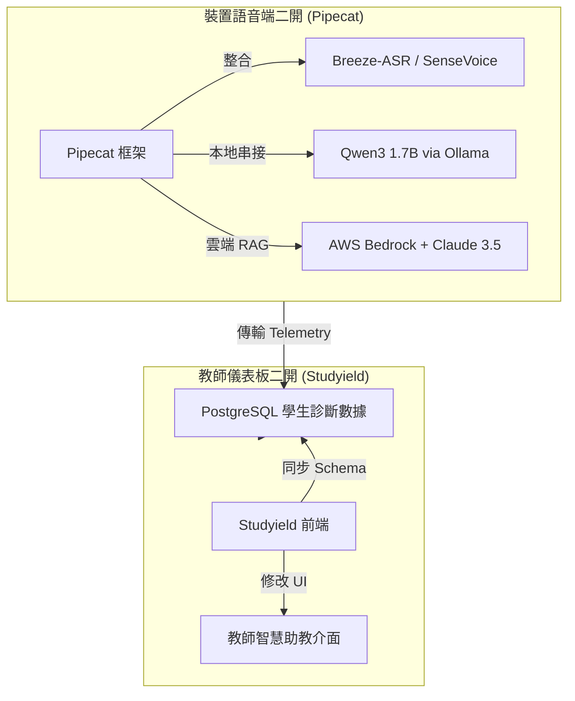

# 「說說學伴」 GitHub 二開開源專案推薦報告

為了加速「說說學伴」原型機與教師智慧平台開發，以下針對**「裝置與語意語伴端（Voice Agent）」**與**「教師分析儀表板端（Learning Analytics）」**，精選了 GitHub 上最適合進行二次開發（二開）的開源專案。

---

## 1. 裝置與語意語伴端 (AI Voice Agent & Local assistant)

這類專案主要處理語音串流、語音活動偵測 (VAD)、ASR (語音轉文字) 串接、LLM (大語言模型對話) 及 TTS (語音合成) 的管線架構。

### 推薦專案矩陣

| 專案名稱 | 技術棧 | 適合場景 | 二開優勢 |
| :--- | :---: | :--- | :--- |
| **[Pipecat](https://github.com/pipecat-ai/pipecat)** | Python | 雲端 / 雙網混成 AI 語音語伴開發 | **極力推薦**。模組化設計，內建打斷（Interruption）處理、VAD 與多模態支援，原生支援 Ollama、Claude、Whisper 等。 |
| **[LiveKit Agents](https://github.com/livekit/agents)** | Python / TS | 高吞吐量、低延遲 WebRTC 語音對話 | 具備極低延遲的 WebRTC 傳輸，適用於展示在線模式的即時語音對話與多重狀態切換。 |
| **[OpenVoiceOS](https://github.com/OpenVoiceOS/ovos-core)** | Python / Linux | 實體硬體 (MediaTek Genio 520) 部署 | 提供完整的開源語音作業系統架構，內建喚醒詞檢測、意圖分析，適合做實體玩具裝置的底層。 |
| **[local-talking-llm](https://github.com/vndee/local-talking-llm)** | Python | 純離線邊緣端語音流水線 PoC 測試 | 結構簡單，使用 Whisper (STT) + Ollama (LLM) + Chatterbox (TTS)，適合作為極簡邊緣端離線測試起點。 |

---

## 2. 教師分析儀表板端 (Learning Analytics & LMS)

這類專案提供學生成效追蹤、知識圖譜、學習進度預測及視覺化儀表板，適合作為「教師智慧助教平台」的二開基底。

### 推薦專案矩陣

| 專案名稱 | 技術棧 | 適合場景 | 二開優勢 |
| :--- | :---: | :--- | :--- |
| **[Studyield](https://github.com/studyield/studyield)** | TS / React | AI 學習追蹤與學力診斷儀表板 | **極力推薦**。包含知識圖譜、學習速率（Velocity）追蹤、學習成效雷達圖與 AI 生成測驗，完美契合本專案的班級雷達圖設計。 |
| **[EdOptimize](https://github.com/playpowerlabs/edoptimize)** | Python / JS | K-12 學習分析平台與課程對齊 | 專為中小學教育設計，內建課程分析、教學實施進度分析，十分適合與教育部酷英網及國教院課綱檢索串接。 |
| **[ClassroomIO](https://github.com/classroomio/classroomio)** | TS / Next.js | 教師課堂管理與學生名冊後台 | 現代化的開源 LMS 替代品，具有極佳的 UI/UX 設計，適合拿來二開作為班級名冊管理與學生互動記錄資料庫的後台。 |

---

## 3. 「說說學伴」二開整合技術路線建議 (Roadmap)

基於上述專案，我們建議以下二開路徑，以最小開發成本達成最高完成度：

### 3.1 步驟一：使用 [Pipecat](https://github.com/pipecat-ai/pipecat) 搭建語音核心管線
1. **VAD 與打斷處理**：Pipecat 內建了優秀的 Silero VAD 與音訊打斷機制，這在雙語對話（如學生說一半改口或 AI 帶讀時）非常關鍵，無需手動開發音訊對齊。
2. **邊緣與雲端雙模切換**：可透過 Python 撰寫一個 Network Manager 模組，動態在本地 Pipecat Service（執行離線 ASR/TTS/Ollama）與雲端 Pipecat Service（執行 Bedrock/Amazon TTS）之間切換。

### 3.2 步驟二：使用 [Studyield](https://github.com/studyield/studyield) 快速生成教師端大腦
1. **診斷數據呈現**：Studyield 已寫好了許多用於評估學生掌握度（Mastery Level）與學習弱項的 React 視覺化元件。
2. **與規格書對接**：將規格書中的 `ai_diagnoses` 資料庫欄位（優勢、弱點、差異化引導建議）作為 API Payload 餵給 Studyield 二開前端，即可在 1 週內完成高完成度的教師智慧儀表板。
