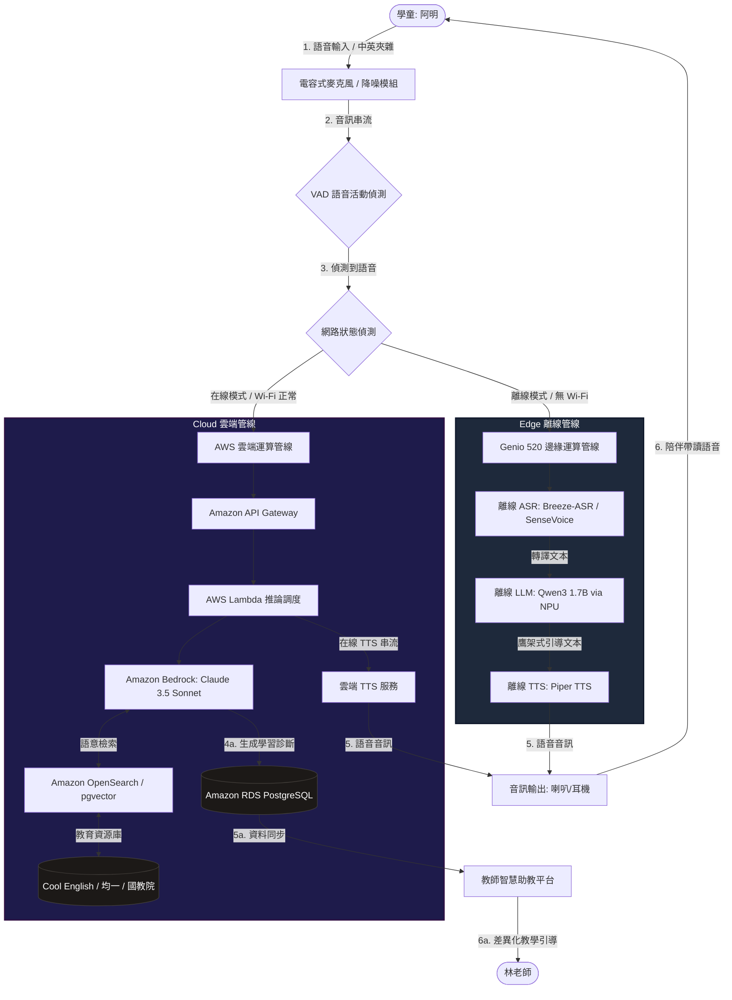
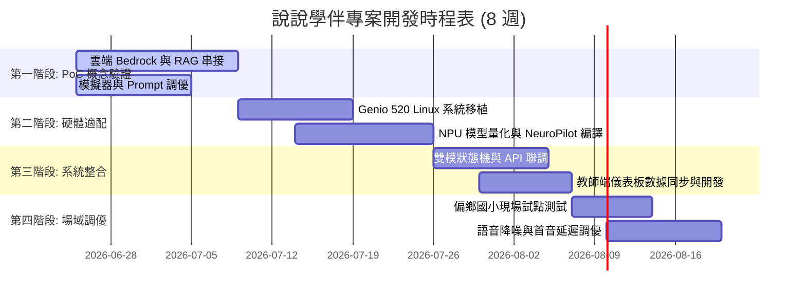

# 「說說學伴」  專案技術棧與開發規格書 (SPEC)

本文件為「說說學伴」 專案的官方技術棧與開發規格書，供開發團隊在實現「無螢幕實體智能語伴玩偶系統」時作為核心技術指引。

---

## 1. 系統整體架構 (System Architecture)

「說說學伴」採用**雙網混成推論 (Hybrid Edge-Cloud Inference) 架獲**。系統會根據邊緣硬體裝置的網路連接狀態（Wi-Fi 連接強度與延遲），動態切換本地 Edge 推論管線與 AWS 雲端推論大腦。

### 1.1 系統架構與資料流向 (Data Flow Diagram)

以下 Mermaid 架構圖說明了語音輸入從邊緣裝置採集，到離線/在線處理，最終呈現給學生（語音）與教師（報表）的完整閉環：



### 1.2 雙網切換與自適應狀態機 (Adaptive State Machine)

硬體端背景行程（Daemon）以每 5 秒一次的頻率 Ping AWS API Gateway 節點，評估網路延遲與封包遺失率，進行狀態轉換：

```
       ┌────────────────────────────────────────────────────────┐
       │                                                        │
       ▼                                                        │
┌──────────────┐     延遲 > 800ms / 斷網 3 次     ┌──────────────┐
│  Cloud Mode  │ ──────────────────────────────> │  Edge Mode   │
│  (在線模式)  │ <────────────────────────────── │  (離線模式)  │
└──────────────┘       延遲 < 300ms / 連線恢復      └──────────────┘
       │                                                        ▲
       │                  背景非同步同步快取                    │
       └────────────────────────────────────────────────────────┘
```

- **Cloud Mode (在線模式)**：音訊特徵上傳雲端，由 AWS Bedrock 提供高精度 RAG 檢索與深度情境對話。
- **Edge Mode (離線模式)**：完全關閉雲端上傳，所有 ASR、LLM、TTS 運算皆在 **MediaTek Genio 520 NPU** 上執行，互動遙測數據（Telemetry）快取至本地 SQLite，待恢復連線時非同步背景上傳。

---

## 2. 邊緣端軟硬體技術棧 (Edge Specification)

本專案基於大會加分項目，採用國產晶片 **MediaTek Genio 520** (HUB G520) 智慧物聯網開發平台，發揮其邊緣 NPU 算力。

### 2.1 硬體接口與系統配置

- **處理晶片**：MediaTek MT8365 (Genio 520), 4x Arm Cortex-A53 @ 2.0GHz, 內建 1.2 TOPS APU。
  > [!NOTE]
  > *註：若使用高級 HUB G520 (MT8370 / Genio 700 延伸版) 則可達 8 核心 (2x A76 + 6x A55) 與 10 TOPS NPU 算力。本規格書以 Genio 平台之通用 NeuroPilot 軟體開發棧進行規範。*
- **音訊硬體**：雙電容式麥克風陣列（硬體 Beamforming 降噪）、3.5W 內建 D 類放大器喇叭、3.5mm 耳機插孔。
- **作業系統**：客製化 Linux (基於 Yocto Project Kirkstone 3.6)，內建 MediaTek proprietary 音訊 DSP 驅動。

### 2.2 邊緣 AI 模型編譯管線 (NeuroPilot NPU 量化編譯)

所有運行於邊緣 NPU 的 AI 模型，皆須通過 MediaTek **NeuroPilot 8 SDK** 進行轉換與優化：

1. **ONNX 格式轉換**：將 PyTorch 權重導出為標準 `onnx` 格式。
2. **模型量化 (Quantization)**：使用 NeuroPilot Toolchain 將 FP32 權重壓制為 **INT8/INT4**，以配合 NPU 運算元。
3. **NPU 編譯**：透過 `apucc` 編譯器將量化後 ONNX 模型編譯為 APU 可執行的 `.bin` 封裝。

```bash
# NeuroPilot 量化與編譯範例指令
neuropilot_convert \
  --model_path ./qwen3_1.7b.onnx \
  --input_shapes "input_ids:1x512" \
  --quantization_mode INT4 \
  --output_path ./qwen3_1.7b_int4.bin
```

### 2.3 離線 AI Pipeline 組件說明

| 模組 | 採用技術/模型 | 規格與性能指標 | 離線使能價值 |
| :--- | :--- | :--- | :--- |
| **語音活動偵測** | WebRTC VAD | 偵測延遲 < 10ms，音量門檻自適應 | 過濾背景噪音，避免無效喚醒 NPU |
| **離線 ASR** | Breeze-ASR / Sherpa-ONNX SenseVoice-Small | 中英雙語，語音識別延遲 < 250ms，模型大小約 140MB | 斷網時仍可精準辨識學童的中英文口說 |
| **離線 LLM** | Qwen3 1.7B / Qwen2.5-Instruct 1.5B (INT4) | NPU 推論速度 > 18 tokens/sec，上下文長度 1024 | 執行「雙語鷹架引導」，給予即時文法示範 |
| **離線 TTS** | Piper TTS (C++ 引擎) | 語音首字延遲 < 150ms，支援臺灣華語男/女聲與英語雙語 | 排除網路延遲的生硬感，提供即時、流暢的語音回應 |

---

## 3. 雲端大腦與 RAG 教材串接 (Cloud & Brain Specification)

當系統處於在線模式時，雲端大腦將啟動，提供深度對話、RAG 教材內容檢索、以及「反思教學 AI 助教」的教學分析。

### 3.1 AWS Bedrock 與基礎模型配置

- **對話與評估核心**：`anthropic.claude-3-5-sonnet-v1:0` (Claude 3.5 Sonnet)
  - 核心能力：負責學生口說語意分析、文法診斷，並依據課綱生成個人化輔導報表。
- **高吞吐對話核心**：`meta.llama3-1-70b-instruct-v1:0` (Llama 3.1 70B)
  - 核心能力：負責大流量的日常對話陪伴與 RAG 內容預處理。

### 3.2 檢索增強生成 (RAG) 管線設計

我們建置了**三源教材向量檢索庫**，串接臺灣本土的數位教育平台：
1. **教育部 Cool English**：提取聽力、口說、字彙等結構化教材。
2. **均一教育平台**：提取國小 3-6 年級英語科知識圖譜（Knowledge Graph）。
3. **國家教育研究院 (NAER)**：對齊臺灣十二年國教英語領域課程綱要（雙語字彙表與句型規範）。

#### RAG 檢索流程圖
```
[學童語音 ASR] ────> [語意特徵提取] ────> [Amazon OpenSearch 向量檢索]
                                                   │
  ┌────────────────────────────────────────────────┘
  ▼
[召回教材: 國小四年級 Unit 3 (食物)] ───> [合併 Prompt] ───> [Claude 3.5 Sonnet] ───> [鷹架語音輸出]
```

### 3.3 反思教學 AI 助教：診斷 Prompt 工程規格

AI 助教核心 Prompt 必須限制模型僅輸出結構化 JSON，以便後端直接儲存至資料庫：

```markdown
# 系統角色：臺灣國小雙語學習扶助 AI 專家

## 輸入資料：
- 學生當前 ASR 文字: "{{student_text}}"
- 學生歷史對話脈絡: "{{chat_history}}"
- 當前對齊課綱單元: "{{curriculum_unit}}"

## 任務：
請分析學生的口說內容，評估其「發音準確度 (Pronunciation)」、「口說流暢度 (Fluency)」、「字彙量 (Vocabulary)」與「句型掌握度 (Grammar)」，並依據臺灣教育部學習扶助標準給予教學指引。

## 限制：
必須僅輸出符合以下 Schema 的 JSON 物件，不得包含額外說明：
{
  "scores": {
    "pronunciation": 0-100,
    "fluency": 0-100,
    "vocabulary": 0-100,
    "grammar": 0-100
  },
  "strengths": "中文優勢描述...",
  "weaknesses": "中文弱項與待改善發音點描述...",
  "instructions": {
    "classroom": "給學校老師的差異化教學建議...",
    "device": "給學伴裝置的下一次互動主題建議（如跟讀特定母音或套用特定句型）"
  }
}
```

---

## 4. API 協議與資料庫 Schema 設計 (Interfaces & Data Specs)

### 4.1 Edge-to-Cloud 遙測數據 payload (Telemetry JSON)

當裝置連線時，會將互動紀錄以 HTTPS POST 傳送至雲端。以下為傳輸 Payload 的標準規格：

```json
{
  "device_id": "GENIO-520-X992",
  "student_id": "STUDENT-AMING-004",
  "timestamp": "2026-06-19T18:24:13Z",
  "network_mode": "edge",
  "audio_duration_sec": 4.5,
  "payload": {
    "raw_input_text": "I want to eat apple.",
    "asr_confidence": 0.92,
    "ai_response_text": "哇，阿明想吃蘋果！跟著我說一遍：I want to eat an apple.",
    "local_evaluation": {
      "fluency_score": 55,
      "detected_phonemes_errors": ["/æ/"]
    }
  }
}
```

### 4.2 資料庫實體關係 Schema (PostgreSQL)

為了支援教師端智慧儀表板（如 `teacher_dashboard.html`）的動態渲染，後端資料庫設計如下：

```sql
-- 學生基本資料表
CREATE TABLE students (
    student_id VARCHAR(50) PRIMARY KEY,
    name VARCHAR(50) NOT NULL,
    age INT NOT NULL,
    grade VARCHAR(20) NOT NULL,
    school_name VARCHAR(100) NOT NULL,
    remedial_level CHAR(1) DEFAULT 'C', -- A: 通過, B: 待加強, C: 極需扶助
    created_at TIMESTAMP DEFAULT CURRENT_TIMESTAMP
);

-- 語音互動歷史表
CREATE TABLE speech_interactions (
    interaction_id SERIAL PRIMARY KEY,
    student_id VARCHAR(50) REFERENCES students(student_id),
    device_id VARCHAR(50) NOT NULL,
    network_mode VARCHAR(10) CHECK (network_mode IN ('edge', 'cloud')),
    student_text TEXT NOT NULL,
    ai_response TEXT NOT NULL,
    pronunciation_score INT CHECK (pronunciation_score BETWEEN 0 AND 100),
    fluency_score INT CHECK (fluency_score BETWEEN 0 AND 100),
    vocabulary_score INT CHECK (vocabulary_score BETWEEN 0 AND 100),
    grammar_score INT CHECK (grammar_score BETWEEN 0 AND 100),
    phoneme_errors VARCHAR(50)[], -- 例如 ['/æ/', '/ɛ/']
    interacted_at TIMESTAMP DEFAULT CURRENT_TIMESTAMP
);

-- AI 教學診斷與差異化指引表 (由 AWS Bedrock 異步解析寫入)
CREATE TABLE ai_diagnoses (
    diagnosis_id SERIAL PRIMARY KEY,
    student_id VARCHAR(50) REFERENCES students(student_id),
    diagnosis_date DATE DEFAULT CURRENT_DATE,
    strengths TEXT NOT NULL,
    weaknesses TEXT NOT NULL,
    emotional_status TEXT, -- 學生的情緒與信心度分析
    sug_classroom TEXT, -- 教師課堂引導指引
    sug_device TEXT, -- 裝置端優化主題建議
    sug_peer TEXT, -- 同儕共學建議
    updated_at TIMESTAMP DEFAULT CURRENT_TIMESTAMP
);
```

---

## 5. 開發里程碑與時程規劃 (Milestones & Roadmap)

專案開發共分為四個階段，以確保在黑客松決賽展示前產出可操作、低延遲的實體原型。



### 階段檢驗點與驗證指標 (KPIs)

1. **第一階段 (PoC) 檢驗點**：
   - 雲端 RAG 在 Cool English 測試集上的召回率（Recall@3）需大於 **85%**。
   - 網頁模擬器能夠完整重現 7 步對話且無 API 報錯。
2. **第二階段 (Hardware MVP) 檢驗點**：
   - 離線 ASR、LLM、TTS 在 Genio 520 NPU 上的推論總記憶體佔用需小於 **1.2GB**。
   - 離線 LLM NPU 推論速度需穩定在 **15 tokens/sec** 以上。
3. **第三階段 (System Alpha) 檢驗點**：
   - 斷網 3秒內系統需能無縫降級至本地 Edge Pipeline，學童互動無中斷感。
   - Telemetry 數據能在網路復原後 30 秒內自動上傳，無資料丟失。
4. **第四階段 (Release) 檢驗點**：
   - 邊緣端「首音延遲 (First-Token Latency)」小於 **200ms**。
   - 社區環境（噪音 > 60dB）下，ASR 識別字準確率 (Word Accuracy) 仍需大於 **80%**。
