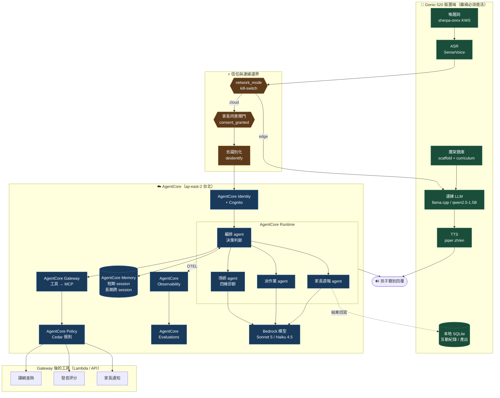
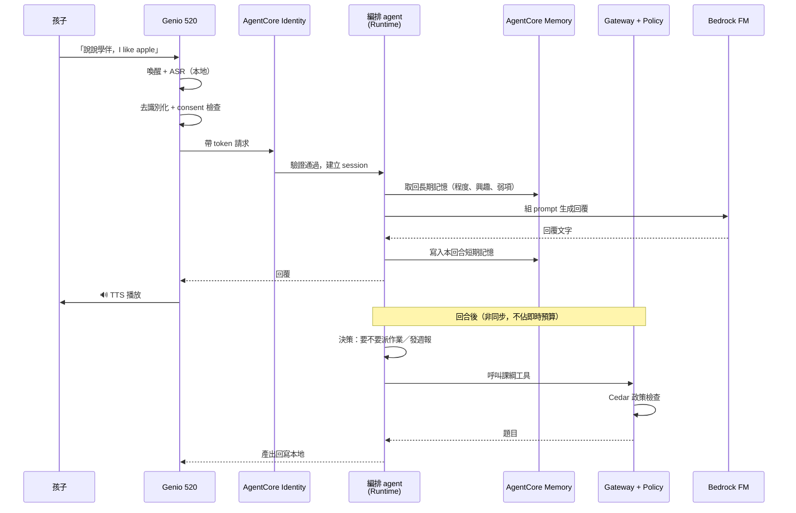
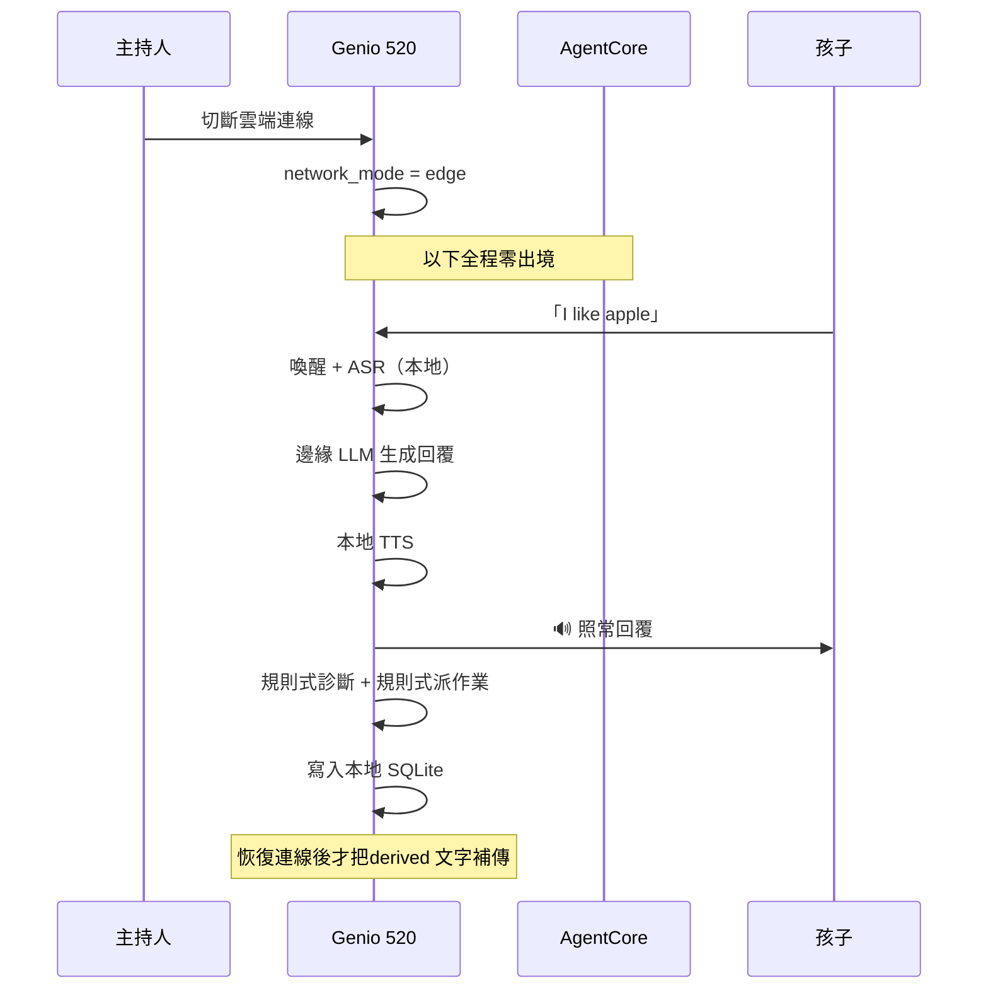
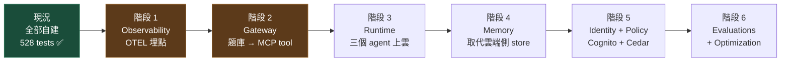

# 說說學伴 × Amazon Bedrock AgentCore — 架構重新設計

**日期**：2026-07-26　**狀態**：設計，尚未實作　**決賽**：約 2026-07-30

---

## 1. 先講清楚現況

**目前的三個 agent 完全沒有用到 AgentCore。**

| 元件 | 現況 |
|---|---|
| `server/agents/orchestrator.py` | in-process 自建，規則式 + Bedrock Converse |
| `server/agents/homework.py` | in-process 自建 |
| `server/agents/report.py` | in-process 自建 |
| `server/diagnose.py` | in-process 自建 |
| 記憶 | 自建 SQLite（`interactions` / `diagnoses` / `student_profile` / `agent_outputs`）|
| 身分 | 自寫 JWT（`server/auth.py`）|
| 護欄 | 自寫規則（`server/guardrails.py`）|
| 觀測性 | 無 |
| 評估 | 無 |

雲端推理只用到 Bedrock 的**模型層**（`boto3 bedrock-runtime.converse()`），
沒有碰 AgentCore 的**代理基礎設施層**。

**為什麼會這樣**：一是 2026-07-08 拍板的鐵律「不引外部 agent 框架，編排用
in-process 輕量控制器」；二是 AgentCore workshop 從 Prereqs 就卡住——先是 IAM
權限不足，補齊 `AdministratorAccess` 後又卡在 AWS 帳號驗證，9 個 lab 一個都沒跑成。

---

## 2. 這次重新設計要面對的核心張力

> **AgentCore 是純雲端的 serverless 平台。**
> **決賽評分最高的記憶點是「主持人當場斷網，裝置繼續離線對話」。**

把全部搬上 AgentCore 等於親手拆掉最高分的橋段。所以正確的設計不是「全部搬過去」，
而是**明確切一條線**：什麼必須留在裝置上，什麼該交給 AgentCore。

這條線就是既有的 kill-switch（`network_mode`）。

---

## 3. 目標架構

**唯讀一句話**：kill-switch 左邊全部在裝置上、斷網照跑；右邊全部是 AgentCore，
斷網時整塊消失但不影響孩子繼續對話。

---

## 4. 自建元件 → AgentCore 對應

| 現有自建 | AgentCore 服務 | 換掉的理由 | 風險 |
|---|---|---|---|
| `orchestrator.py` 決策判斷 | **Runtime**（或 **Harness**）上的主 agent | Harness 一次 API 呼叫就有 agent loop + 工具執行 + 記憶，不必自己寫編排 | 決策延遲從 in-process 變成一次網路往返 |
| `homework.py` / `report.py` | **Runtime** 非同步 agent | Runtime 明確支援長時間非同步代理，正好對上 12s 預算的路徑 | 冷啟動 |
| `diagnose.py` 四維診斷 | **Runtime** agent + **Evaluations** | Evaluations 能對 session/trace 做自動化品質評估，取代目前「無評估」的狀態 | 需 OTEL 埋點 |
| SQLite `interactions` / `diagnoses` | **Memory**（短期 = 多輪對話，長期 = 跨 session） | 官方支援跨 agent 共享記憶庫，目前三個 agent 各自讀 store 是重複邏輯 | **斷網時完全不可用**，本地必須保留 |
| `auth.py` 自寫 JWT | **Identity** + Cognito | 不必自己維護簽發/驗證，且與 Gateway 的工具授權打通 | 現有 `_resolve_student` 邏輯要重寫 |
| `guardrails.py` 護欄 | **Policy**（Cedar）+ Bedrock Guardrails | Policy 在 Gateway 攔截**每一次工具呼叫**，比事後過濾強；兒童安全是硬限制 | Cedar 要學 |
| `scaffold.py` / `curriculum.py` 題庫 | **Gateway** 包成 MCP tool | 讓任何 MCP 相容的 agent 都能取用課綱，不必複製邏輯 | 題庫查詢變成網路呼叫 |
| 無 | **Observability**（OTEL → CloudWatch） | 目前完全看不到 agent 在做什麼，現場出事無法查 | — |
| 無 | **Optimization** | 用 trace 自動產生 prompt 改善建議 + Gateway 分流做 A/B | 需先有 Evaluations |

---

## 5. 兩條時序：連線 vs 斷網

### 5.1 連線時（AgentCore 全開）

### 5.2 斷網時（主持人切 kill-switch）

**這張圖是決賽的核心賣點**：右邊那條線整個消失，孩子端**完全無感**。

---

## 6. 遷移路徑（分階段，可隨時停在任一階段）

**階段排序的理由**：

1. **Observability 先做** — 零風險、不改行為，但立刻讓現場出事查得到。而且
   Evaluations 與 Optimization 都建立在 OTEL trace 上，先埋才有後面。
2. **Gateway 次之** — 把題庫包成 MCP tool，既有程式碼不動，只是多一條取用路徑。
3. **Runtime 第三** — 這一步才真的改變執行位置，也是第一個會影響延遲的步驟。
   對話路徑（1.5s 預算）**不建議**搬，只搬非同步的診斷/作業/週報。
4. Memory / Identity / Policy / Evaluations 屬於加值，時間不夠可全部不做。

**現實提醒**：階段 1 之後的每一步都需要 AWS 帳號驗證通過。
截至 2026-07-26 仍是 `Your account is currently being verified`，因此
**目前一階段都動不了**。

---

## 7. 我對「全面改用 AgentCore」的保留意見

必須誠實講三件事：

1. **對話路徑不該上 AgentCore。** 1.5 秒是斷網橋段 D-03 的驗收上界，
   目前 `cloud_llm` 直呼 Converse 已經很緊。多一層 Runtime 就是多一次網路往返，
   風險大於收益。**建議只搬非同步路徑。**

2. **離線能力無法被 AgentCore 取代，只能並存。** Memory 再好，斷網時就是零。
   本地 SQLite 與規則式 fallback 必須保留，這代表「兩套邏輯」的維護成本
   不會因為上了 AgentCore 而消失，反而增加。

3. **4 天內做不完，也不該做完。** 528 個測試守著的自建版本現在是可用的、
   離線端到端跑通的。全面重寫會把已驗證的東西換成未驗證的。
   **建議只做階段 1–2 當作加分敘事，主線維持現狀。**

如果決賽評分明確要求「使用 AgentCore」而非「使用 Bedrock」，那就以階段 3
只搬週報 agent 為最小可展示切片——它是非同步、延遲無所謂、且在教師儀表板上
看得見，風險最低而展示效果最完整。
