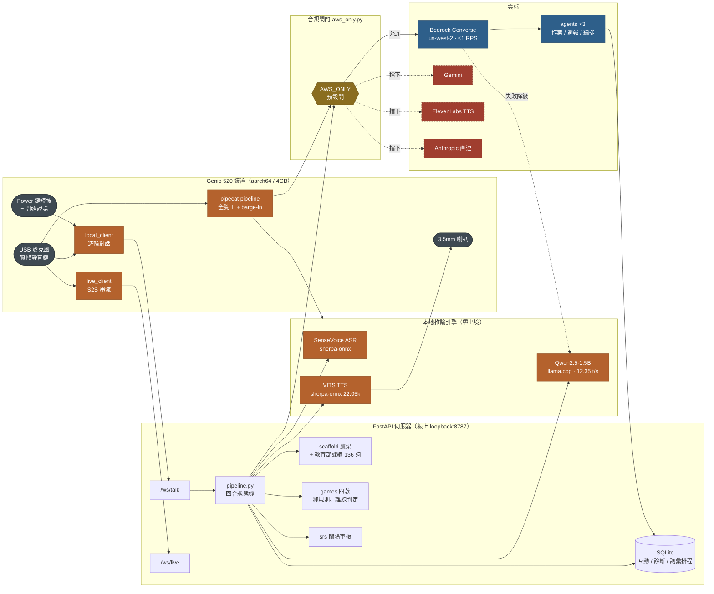
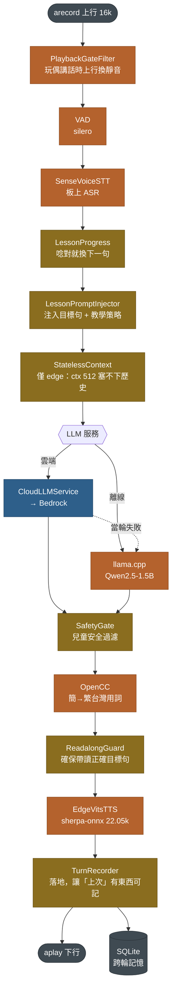
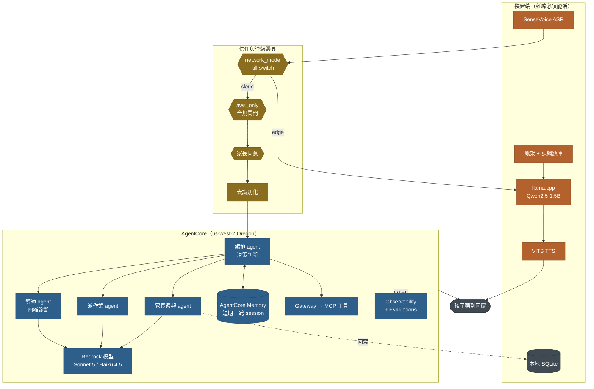

# 系統架構三視圖

> **2026-08-01。** 對應 `master` 的實際狀態。
> 每個元件都標了驗證狀態——**沒有實測撐著的東西不要當事實引用**。

三張圖回答三個不同的問題：

| 視圖 | 回答的問題 |
|---|---|
| 01 現況 | 今天真的在跑的是什麼？ |
| 02 pipecat 管線 | 裝置端那條全雙工串流長什麼樣？ |
| 03 AgentCore | 雲端要往哪裡去？（**目標，不是現況**） |

圖例：🟠 裝置端　🔵 雲端　🟡 邊界閘門　🔴 競賽規範擋掉

---

## 視圖 01 — 現況

兩條客戶端路徑共用同一個 FastAPI 伺服器與同一批本地引擎。
合規閘門 `server/aws_only.py` 擋在所有雲端出口之前，**預設開啟**。

### 有實測撐著的性質

- **孩子的語音從不離開裝置。** ASR 在板上跑，只有文字可能上雲。
  證據：`edge/EDGE_TURN_LOOP_VALIDATION.md` — 25 秒 tcpdump、零對外封包。
  這同時滿足競賽環境規範第 2 條「不得匯入生物識別資料」。
- **斷網照跑。** 四款遊戲的判定是純函式，離線與連網逐字相同
  （`tests/test_games_wiring.py` 的 online/offline 一致性測試）。
- **降級是設計的一部分**，不是意外：雲端失敗當輪就退回本機 Qwen。

### 已知邊界

- `/ws/live` 走 Nova Sonic S2S，需要 `InvokeModelWithBidirectionalStream`。
  該 action **不在《Supported AWS Services List 20260722》的 13,893 個 action 裡**
  （`bedrock` 命名空間的 Stream 只有 `AgenticRetrieveStream` 與
  `InvokeModelWithResponseStream`）。競賽期間這條路不可用。
- Gemini / ElevenLabs / Anthropic 三條都能跑、也都驗過真機，
  但競賽期間一律被 `server/aws_only.py` 擋掉（規範：僅限 AWS 服務）。
- **NPU 沒有參與任何推論。** 實測 `DAY1_NPU_PROBE: FAIL 0/0 ops on
  NeuronExecutionProvider`（`edge/npu_spike/ADR-npu-path.md:24`）。
  三個引擎全在 CPU 上。

---

## 視圖 02 — 裝置端 pipecat 串流管線

十三個節點，跑在板子上。四個 adapter 原本規劃要自寫，實裝後只剩
`alsa_transport` 一個——其餘直接用 pipecat 既有基類。整條 RSS 747MB。

### 每個設計決定都是被什麼逼出來的

| 設計決定 | 起因 |
|---|---|
| 上行閘門攔在 VAD **之前** | 只用 pipecat 的靜音策略不夠，玩偶仍會聽到自己（真人實測，`1e04ea1`） |
| 無狀態 context 只給 edge | `--ctx-size 512` 實測 516→579→642 tokens 就爆；雲端 context 遠大於此，留著它玩偶就永遠不記得上一輪 |
| 去識別化只在雲端路徑 | edge 是本機推論，孩子的話沒離開玩偶；遮了只會讓模型看到 `[名字]` 而降低品質 |
| 播放取樣率參數化 | aplay 取樣率曾寫死 24k，pipecat 這條是 22.05k——算錯就算錯播放時長，閘門提早開，玩偶收到自己的尾音（`48cdff3`） |
| 空檔餵靜音 keepalive | 等孩子回答的空檔出現 4 次 underrun，每次 2.4–4.1 秒，下一句開頭破音（`2294758`） |

### 有實測撐著的性質

- 全雙工、可 barge-in——孩子可以打斷玩偶。
- 雲端與離線**共用同一條管線**，只換 LLM 那一格。降級不改變其他 12 個節點的行為。
- 安全與教學護欄（`SafetyGate` / `ReadalongGuard`）在**兩條路徑上都生效**，
  不因為走雲端就鬆綁。

### 已知邊界

- **喚醒詞不可用。** 真人測試約 11 次僅 1 次命中，已判 NO-GO
  （`edge/NATIVE_KWS_PLAN.md:105`）。實際觸發是 **power 鍵短按**。
  閉環自檢用 TTS 合成音會通過——**那是假的信心**，因為合成音音高平穩、咬字規整。
- `CloudLLMService` 至今接的是 Gemini。**換成 Bedrock 尚未驗證。**

---

## 視圖 03 — 雲端目標：Bedrock AgentCore

> **這是目標架構，不是現況。**
> 完整版與逐項對應表見 [`AGENTCORE_ARCHITECTURE.md`](AGENTCORE_ARCHITECTURE.md) §3，
> 那份是權威來源；本節是精簡版，兩者衝突時以該檔為準。

kill-switch 左邊全部在裝置上、斷網照跑；右邊全部是 AgentCore，
斷網時整塊消失但不影響孩子繼續對話。

### 元件狀態

| 元件 | 狀態 | 憑據 |
|---|---|---|
| 客戶端已接線 | 已實作 | `server/agentcore.py`；三個 agent 的降級鏈第一層 |
| API 契約已對齊 | 離線驗證 | `InvokeHarness` 回 EventStream 已修正，用本機 botocore service model 釘住欄位名（`tests/test_agentcore_client.py`） |
| 佈建腳本 | `--dry-run` 過 | 形狀全過；`arn` 欄位與執行角色權限已修正並有測試 |
| **實際佈建** | **未驗證** | 沒跑過 `--apply`，沒建立過 Harness，沒收過一次真實 `InvokeHarness` 回應 |
| 自建 orchestrator | 可用回退 | `server/agents/`，決策/執行分離、schema 驗證、白名單投影、規則式保底 |

### 已知邊界

- **不能宣稱「跑在 AgentCore 上」。** 到 2026-08-01 為止全部是離線推導
  與 service model 比對的結果。
- Memory / Gateway / Identity / Policy / Evaluations 都是**設計**，沒有實作。
- `deploy/aws/AGENTCORE_RESOURCES.md` 記的是自有帳號手建的 ARN，
  **帳號綁定、現已失效**，不要照抄。

---

## 相關文件

| 檔案 | 內容 |
|---|---|
| [`AGENTCORE_ARCHITECTURE.md`](AGENTCORE_ARCHITECTURE.md) | AgentCore 目標架構的權威版本與遷移路徑 |
| [`ARCHITECTURE_NARRATIVE.md`](ARCHITECTURE_NARRATIVE.md) | 架構敘事與設計取捨 |
| [`OPERATIONS_MODEL.md`](OPERATIONS_MODEL.md) | 部署與現場操作模型 |
| [`GAMES.md`](GAMES.md) | 四款互動遊戲與離線判定 |
| `edge/EDGE_TURN_LOOP_VALIDATION.md` | 邊緣回合迴圈的真機實測數據 |
| `edge/BOOT_SOP.md` | 裝置開機 SOP（含唯一的手動步驟） |
