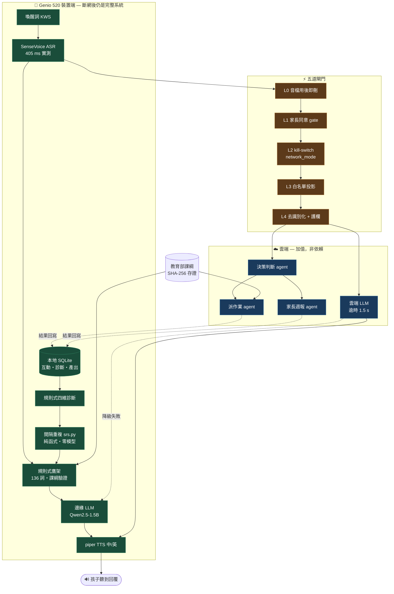

# 架構敘事：生成式 AI 的使用架構

> 建立於 2026-07-28。用途：決賽評分「創意度（20%）」明文提到評的是
> **「生成式 AI 的使用架構」**——不是模型多大、不是功能多少，而是**怎麼用**。
>
> 這份文件把已經實作出來的架構決策，翻譯成評審聽得懂的敘事。
> **它不新增任何功能**，全部對應到現有程式碼與已驗證的行為。
>
> **資料紀律**（沿用 `docs/OPERATIONS_MODEL.md`）：
> `實測` = 真機或測試套件量到的，附出處；
> `設計` = 已實作的架構決策，附 `檔案:行號`；
> `未證` = 尚未驗證，明確標示，**不得在簡報中當成事實講**。

---

## 0. 一句話

> **我們的創意不在模型，在於把生成式 AI 切成「可以斷掉的部分」與「不能斷掉的部分」，
> 並且讓它斷掉的時候，孩子聽不出來。**

決賽現場主持人會當場切斷雲端。孩子繼續對話，一秒都不停。
那不是表演——那是這個架構的**必然結果**。

---

## 1. 我們拒絕的三種主流作法

創意度要看的是「為什麼這樣設計」。最有效的講法是先講**我們沒有選什麼**。

| 主流作法 | 為什麼在這個場景不成立 | 我們的選擇 |
|---|---|---|
| **A. 全雲端 LLM app**（接 API、做個 UI） | 最需要英語補救的地區，網路本來就不穩（`docs/NEEDS_EVIDENCE.md` §C2）。一斷線整堂課停擺 | **雙模式共存**：edge 與 cloud 都是一等公民，不是主/備 |
| **B. 純本地小模型**（追求純離線） | 1.5B 模型的教學品質有上限，且**冷啟動 5.85 s** `實測`。只做本地等於自我設限 | **三層降級鏈**：雲端是加值不是依賴，斷了自動退，退了照樣教 |
| **C. 用 agent 框架跑即時對話**（LangChain / AgentCore Runtime 接進對話迴圈） | 每一層都是延遲，而且**框架在雲上，斷網即死** | **即時路徑 in-process**，agent 只負責非同步的教學決策 |

> C 這條是本專案 2026-07-08 就拍板的鐵律，在 `docs/AGENTCORE_ARCHITECTURE.md` §7
> 又重新論證過一次：對話路徑多一次網路往返，風險大於收益。
> **「知道什麼不該上雲」本身就是架構能力。**

---

## 2. 主張一：kill-switch 是架構的軸心，不是一個開關

一般系統的離線模式是**錯誤處理**（try/except 的 except 分支）。
本專案把它拉到**架構分界線**的位置：`network_mode` 決定整個系統的形狀。

### 2.1 設計 `設計`

- `network_mode` 全專案**只有三個寫入點**，全在 `server/app.py`
  （`:66` 啟動預設、`:277` 未同意強制 edge、`:285` 端點切換）——單一真相來源
- 進行中的 WebSocket 連線**每回合重新同步**一次全域值
  （`server/app.py:424,483`），所以主持人切換時**不必重整頁面、不必重連**
- 切換端點有 JWT 閘門（`server/app.py:229`）——否則同網段任何裝置都能翻轉「離線」的宣稱

### 2.2 這條線左右各有什麼

| kill-switch 左邊（裝置上，斷網照跑） | 右邊（雲端，斷網整塊消失） |
|---|---|
| 喚醒詞 KWS、SenseVoice ASR | 雲端 LLM（Bedrock Converse） |
| llama.cpp / Qwen2.5-1.5B | 雲端情感 TTS |
| piper TTS（中／英） | 三個教學 agent 的雲端推理路徑 |
| 規則式鷹架題庫 + 課綱資料 | — |
| 本地 SQLite（互動、診斷、產出） | — |
| 規則式四維診斷、規則式派作業、間隔重複排程 | — |

**右邊全部消失時，左邊自成一個完整的系統。** 這是刻意的：右邊每一項都有左邊的對應實作。

### 2.3 證據 `實測`

Phase 9 驗證報告（`.planning/phases/09-network-cut-demo-hardening/09-VERIFICATION.md`）：
6 項可自動化驗證的 must-have 中 **5 項 VERIFIED**，含一條真的把 WS 開著切換模式的
行為測試（`tests/test_e2e.py::test_network_mode_switch_affects_live_ws_session`）。

`未證`：真機 ≥3 次斷網演練的 M1（降級決策延遲）數字**尚未回填**
（`edge/NETWORK_CUT_REHEARSAL.md` §5 空白）。簡報**不得**講「實測 1.x 秒」。

---

## 3. 主張二：三層降級鏈，而且每一層都仍然「教得對」

`server/pipeline.py:267-296`：**cloud → edge → 鷹架**，任一層逾時／例外／回空就續試下一層。

| 層 | 由誰生成 | 斷網時 | 教學品質保證 |
|---|---|---|---|
| L1 雲端 LLM | Bedrock Converse | ✗ 不進入 | 最佳 |
| L2 邊緣 LLM | llama.cpp / Qwen2.5-1.5B | ✓ | 可接受 |
| **L3 規則式鷹架** | `server/scaffold.py`，**零模型** | ✓ | **保證正確**：136 詞全部經課綱驗證 |

**關鍵在 L3。** 多數系統的最後一層是錯誤訊息；我們的最後一層是**一個仍然合格的英語老師**：

- 題庫 136 詞，**99.3% 落在教育部基本 1,200 字內**，例句用字同樣經
  `server/curriculum_data.py` 程式驗過（`tests/test_scaffold_vocab.py` 釘成回歸守門）
- ASR 低信心時走 `FALLBACK_LINES` 輪替（`server/pipeline.py:180,251`），
  **不寫 DB、不亂猜**——寧可說「我沒聽清楚」也不編造孩子沒說的話

### 3.1 逾時隔離：讓雲端的慢不會餓死本地 `設計`

這是 Phase 9 學到、且反直覺的一課：**不能把所有 timeout 一起砍短。**

| 常數 | 值 | 理由 |
|---|---|---|
| `cloud_llm._TIMEOUT_S` | **1.5 s** | 雲端沒回就快點放棄，讓降級快 |
| `config.CLOUD_TTS_TIMEOUT_S` | **1.5 s** | 同上 |
| `pipeline.LLM_TIMEOUT_S` | **8.0 s**（維持寬鬆） | 真機 edge 引擎最壞 4,170 ms，砍短會**把本地餓死** |

> 一句話講給評審聽：**「我們縮短的是『放棄雲端』的時間，不是『等待本地』的時間。」**

---

## 4. 主張三：生成式 AI 有四種用途、四種延遲預算、四種失敗處理

**這一節就是「生成式 AI 的使用架構」的正面回答。**
大多數作品只有一種用法：使用者說話 → LLM 回話。我們有四種，且各自的工程處理完全不同。

| # | 用途 | 執行位置 | 延遲預算 | 失敗時 | 事實依據 |
|---|---|---|---|---|---|
| 1 | **即時陪聊**（孩子聽到的那句） | edge 優先 | **穩態 2.96–2.99 s** `實測` | 降到規則式鷹架 | 課綱題庫 + 鷹架句型 |
| 2 | **四維診斷**（流暢／字彙／文法／發音） | 非同步背景 | 無即時預算 | 規則式平滑計分（`server/diagnose.py:125`） | 近期互動 + 前次診斷 0.6/0.4 平滑 |
| 3 | **三個教學 agent**（決策判斷／派作業／家長週報） | 非同步、可上雲 | 秒級無所謂 | 每個 agent 都有規則式保底 | **教育部課綱官方資料** |
| 4 | **間隔重複排程**（明天該複習哪些字） | 純函式，零模型 | — | 不適用（不用模型就不會失敗） | SM-2 二元評分變體 |

### 4.1 為什麼分成四種是創意而不是複雜

因為**它們的失敗代價完全不同**：

- 用途 1 失敗 = 孩子當場聽到沉默 → 所以必須有零模型的保底
- 用途 3 失敗 = 老師晚一天看到週報 → 所以可以放心上雲、可以慢

**把不同失敗代價的東西混在同一條路徑上，是多數 AI 應用最常見的架構錯誤。**
我們把它們拆開，代價是兩套邏輯的維護成本——這個代價我們認了，而且在
`docs/AGENTCORE_ARCHITECTURE.md` §7.2 明文記錄過。

### 4.2 生成不是自由發揮：課綱是可查證的事實依據 `設計`

三個 agent 與題庫共用一份**有出處、有雜湊**的官方資料：

- 來源：國教院官方 ODT，教育部 107.04.16 發布《十二年國教課程綱要 語文領域－英語文》
- 落地：`data/curriculum/moe_english_2018.json`，**含來源網址與 SHA-256**
- 抽取腳本可重跑：`scripts/extract_curriculum.py`
- 查詢層：`server/curriculum_data.py`；端點 `GET /api/curriculum`（公開資料，不需 JWT）

> 對評審的一句話：**「我們的 AI 出的每一個字，都查得到它在課綱的哪一頁。」**

**同時要守住的誠實邊界**（`server/curriculum_data.py` docstring 已寫明）：
領綱字彙表是國中小共用、官方**沒有**逐年級切分；`band → 難度` 的對應是**本專案的推論**，
不是課綱規定。簡報不得講成「依照課綱的年級規定」。

### 4.3 閉環：診斷 → 排程 → 明天的題目 `設計`

`server/srs.py`（SM-2 二元評分變體）把用途 2 的結果餵回用途 1 與 3：

答對 → 間隔 1 → 6 → `× ease` 遞增（上限一學期）；答錯 → 間隔歸零、立刻回到題庫、ease 下調（下限 1.3）。

兩個刻意的設計：
- `schedule()` **不讀時鐘**，時間由呼叫端傳入 → 純函式、可測、可離線
- 評分判準直接重用 `profile.build_profile` 的掌握度定義，**不另立一套標準**

**這是「學伴」與「聊天機器人」的分界**：聊天機器人每一輪都從零開始，
學伴記得你上週哪個字沒學會。

---

## 5. 主張四：隱私是五道獨立的閘門，不是一個 checkbox

兒童語音 + 生成式 AI，是最容易讓家長不敢用的組合。我們的處理是**縱深防禦**——
每一道獨立成立，任何一道失效，其他四道仍然擋得住。

| # | 閘門 | 實作位置 | 擋住什麼 |
|---|---|---|---|
| L0 | **音檔用後即刪** | `server/pipeline.py:144,152,217`（`finally` 中 `os.unlink`） | 原始語音**絕不落地、絕不上雲** |
| L1 | **家長同意 gate** | `server/guardrails.consent_granted()`；未同意 → `server/app.py:277` **強制 edge-only** | 沒同意就沒有雲端路徑，不是「先送再說」 |
| L2 | **kill-switch** | `network_mode`（§2） | 主持人／家長可隨時物理性關掉出境 |
| L3 | **白名單投影** | `server/agents/privacy.py` | 只有列舉過的欄位能上雲 |
| L4 | **去識別化 + 內容護欄** | `server/guardrails.deidentify()`、L2 system prompt 常數、L3 輸出後置過濾 | 個資詞、連續數字、不當內容 |

### 5.1 L3 這道最值得講：為什麼是白名單，不是黑名單

這是本專案修過的一個**真實的隱私漏洞**（B4），而修法本身就是架構思考的展示。

**原本的錯誤**：把整包 diagnosis `json.dumps` 後送上雲，遮罩只蓋三個白名單欄位。
漏掉的 `companion_directive` 與 `instructions` 是 **LLM 依孩子講的話生成的自由文字**——
孩子說「我是王小明，今天跟哥哥去…」，名字就直接落在裡面。

**更關鍵的發現**：`guardrails.deidentify` **擋不住中文姓名**。
它只遮明確個資詞、三位以上連續數字、非詞庫的 Title-case 英文專名。
所以**「有呼叫 deidentify」從來不等於「沒外洩」**。

**兩種失敗模式的比較**（`server/agents/privacy.py` docstring）：

| | 失敗模式 | 後果 |
|---|---|---|
| 黑名單 | 新增欄位、忘記同步遮罩清單 | **靜默上雲**，看不見、不可回復 |
| 白名單 | 忘記更新清單 | 該送的沒送 → 雲端產出品質下降，**看得見、可回復** |

> **「隱私的預設值必須是『不送』。」**

修法時測試**不 mock `deidentify`**，直接攔截送上雲的 prompt 字串斷言中文姓名不在裡面——
修之前三個 agent 全紅。**驗行為，不驗有沒有呼叫函式。**

---

## 6. 整體架構圖（依實作現況，非設計願景）

**唯讀一句話**：把右邊整塊塗掉，左邊仍然是一個會教英語、會診斷、會排複習的完整系統。

> 與 `docs/AGENTCORE_ARCHITECTURE.md` 的圖的差別：**那張是設計願景（尚未實作）**，
> 這張是**現在真的在跑的東西**。簡報請用這張。

---

## 7. 簡報講稿

### 7.1 六十秒版（斷網橋段的旁白）

> 現在我請主持人切斷這台裝置的網路。
>
> ——切了。孩子繼續講，它繼續回。沒有轉圈圈、沒有「連線失敗」。
>
> 因為我們一開始就不假設有網路。這台裝置上有完整的語音辨識、語言模型、語音合成，
> 和一份**教育部課綱驗證過的題庫**。網路對它來說是加分項，不是必需品。
>
> 這不是技術炫技。**台灣最需要英語補救的地區，網路本來就不穩。**
> 一個上網才能用的英語學伴，剛好在最需要它的地方用不了。

### 7.2 三分鐘版（架構段）

1. **問題**（20 秒）：偏鄉英語待加強超過五成，最缺的是「陪你講」的時間；
   而政府現行的數位學伴，瓶頸卡在人力與網路。
2. **拒絕的作法**（30 秒）：講 §1 的三行表格——為什麼全雲端、純本地、agent 框架都不對。
3. **軸心**（40 秒）：kill-switch 不是開關，是架構分界線。左邊自成完整系統。
4. **四種用途**（40 秒）：講 §4 的表——**同一個系統裡，LLM 有四種延遲預算與四種失敗處理**。
   即時陪聊失敗代價是當場沉默，家長週報失敗代價是晚一天，所以工程處理必須不同。
5. **隱私**（30 秒）：五道閘門；重點講 L3 為什麼是白名單，以及
   「有呼叫去識別化 ≠ 沒外洩」這個發現。
6. **收尾**（20 秒）：**890 個自動化測試** `實測` 守著這套行為，含一條真的把 WebSocket
   開著切換模式的端到端測試。

---

## 8. 評審可能追問，與準備好的答案

| 追問 | 回答 |
|---|---|
| 「這不就是有網路走雲端、沒網路走本地？」 | 差別在**降級的粒度與保證**。我們是三層、每回合重新決策、且最後一層零模型仍教得對。而且逾時是**不對稱**的：放棄雲端 1.5 s，等待本地 8.0 s——因為真機 edge 最壞 4,170 ms，一起砍短會把本地餓死。 |
| 「1.5B 的模型教得好嗎？」 | 誠實：教學品質有上限，所以我們**不讓它獨自承擔正確性**。正確性由課綱驗證過的鷹架題庫保證，LLM 負責的是自然度。冷啟動 5.85 s 也還沒達標，現場靠先暖場一輪規避——**這是營運手段，不是修好了**。 |
| 「為什麼不用 AgentCore / agent 框架？」 | 對話路徑不該上——1.5 s 的預算多一次網路往返就爆，而且斷網即死。非同步路徑我們有完整遷移設計（`docs/AGENTCORE_ARCHITECTURE.md` 六階段）。**知道什麼不該上雲，跟知道怎麼上雲一樣重要。** |
| 「斷網時教學品質掉多少？」 | 目前**沒有量化對照數字**（`未證`）。可講的是結構：字彙與句型的正確性不掉（同一份課綱題庫），掉的是回覆的自然度與個人化深度。**不要編數字。** |
| 「隱私真的守得住嗎？」 | 講 L3 那段——我們自己找到並修掉一個真的外洩（B4），而且發現「有呼叫去識別化」不等於安全。**會講自己漏洞的團隊，比宣稱沒有漏洞的可信。** |
| 「用了國產晶片嗎？」 | Phase 8 已在 Genio 520 真機跑完整離線迴圈（近端原型演示）。NPU 加速路徑我們試過並**否證**了——MDLA 拒收 attention 的 140 個 `BATCH_MATMUL`，附完整 PreOpCheck log。 |

---

## 9. 不得宣稱（誠實邊界，簡報前逐條核對）

- ⛔ **不得說「已用 AgentCore」**。`docs/AGENTCORE_ARCHITECTURE.md` 是**設計，尚未實作**；
  雲端只用到 Bedrock 的**模型層**（`boto3 bedrock-runtime.converse()`）。
  已建立的 AgentCore 資源（Memory + 3 個 Harness）在**新加坡 `ap-southeast-1`**，
  程式碼已接好但 **flag 關閉**（`TALKYBUDDY_AGENT_BACKEND` 未設即走原路徑）。
- ⛔ **不得說雲端路徑「已驗證」**。AWS 帳號驗證未通過，模型呼叫從未成功
  （`deploy/aws/STATUS.md`）。Phase 11 真機彩排判準是 `source` 從 `rule` 變 `cloud`，**尚未達成**。
- ⛔ **不得引用 M1 降級延遲的數字**。真機演練結果表空白（`edge/NETWORK_CUT_REHEARSAL.md` §5）。
- ⛔ **不得說冷啟動已解決**。5.85 s 未達 3–4 s 門檻，現場靠主持人暖場規避。
- ⛔ **不得說「一台學校只要 X 元」**。無量產 BOM 報價（`docs/OPERATIONS_MODEL.md` §1.2）。
- ⛔ **不得說「一年省 X 元」**。雲端 per-turn 成本未量測，只講結構（零邊際成本 vs 線性成本）。
- ⚠️ **不得說「Genio 520 沒有 GPU」**。真機有 **Mali-G57 2 cores**
  （`/dev/mali0`、`vulkaninfo`、`clinfo` 三方確認）。`server/config.py` 原本寫錯的註解
  已於 2026-07-29 更正。正確說法：**有 GPU，但板上 llama.cpp binary 未編進 GPU 後端，
  目前是純 CPU 推論**——這也是唯一還沒被否證、且不需 NDA 的加速路徑。

---

## 10. 這份文件對應的評分項

| 評分項 | 權重 | 本檔的貢獻 |
|---|---|---|
| 創意度 | 20% | §1–§5 全部（「生成式 AI 的使用架構」的正面回答） |
| 主題切合度（普惠） | 25% | §7.1 的旁白把斷網定位成**普惠的硬證據**，非技術表演 |
| 可行性 | 20% | §3.1 逾時隔離、§9 誠實邊界（與 `docs/OPERATIONS_MODEL.md` 互補） |
| 完成度 | 15% | §7.2 收尾的 890 測試 `實測` |

---

_對應：`docs/OPERATIONS_MODEL.md`（落地維運）、`docs/NEEDS_EVIDENCE.md`（需求數據）、
`docs/PRIVACY.md`（資料政策）、`docs/AGENTCORE_ARCHITECTURE.md`（雲端設計願景，未實作）、
`.planning/phases/09-network-cut-demo-hardening/09-VERIFICATION.md`（斷網行為驗證）。_
