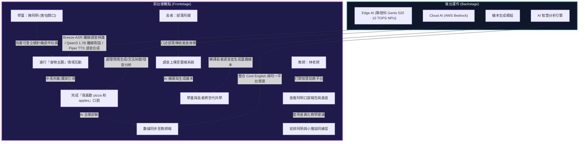

# 「說說學伴」初賽加強版補充資料集

本文件為「說說學伴」提案的實證與設計補充材料，旨在以客觀數據、服務設計思維與多媒體腳本，全面強化提案在「主題切合度 (40%)」、「應用性 (35%)」與「創意度 (25%)」三大核心維度的評審說服力。

---

## 📊 臺灣偏鄉教育落差與政策實證數據 (主題切合度 40%)

大會命題精神為「晶創未來」，探討如何運用創新科技解決社會變遷痛點。以下彙整臺灣偏鄉英語教育的真實數據，說明「說說學伴」切入點的迫切性：

### 1. 英語學力落差：會考與學習扶助篩選測驗

| 指標項目 | 偏遠地區數據 | 全國平均數據 | 差距倍數 / 說明 |
| :--- | :---: | :---: | :---: |
| **學習扶助篩選測驗未通過率** | 偏鄉國中小各科未通過率較高 | 全國平均基底 | **1.3 至 2.4 倍** |
| **國中教育會考英語「待加強 (C)」比例** | 長期維持在 **47% 以上** | 約 23.66% - 32.25% | **1.78 至 1.90 倍** |
| **花蓮偏遠地區國中英語待加強比例 (案例)** | **74.15%** | 42.32% (同縣非偏鄉) | **1.75 倍** (極度不均) |

> [!IMPORTANT]
> **痛點解讀**：偏鄉英語教育的「放棄」現象在國小中高年級即開始累積。學童因基礎未打穩、聽不懂，形成「學習無助感」。

### 2. 師資結構性短缺與流動率

- **代理教師比例高**：偏鄉學校代理教師比例高達 **20%**，遠超一般地區。
- **英語非專長授課普遍**：偏鄉常因招考多次仍無人應聘，英語課程須由校內其他科目正式教師「兼任」或「非專長授課」，導致教學效果出現斷層。
- **高流動性**：偏鄉英語教師流動率極高，學童常面臨「每學期換英語老師」的困境，教學脈絡難以延續。

### 3. 「生生用平板」政策下的軟體真空

- **硬體已齊備**：教育部「中小學數位學習精進方案」於 2022-2025 年投入 200 億元，配送 **61 萬台平板**，偏鄉已達成 **1:1 (一人一機)** 的配發比例。
- **軟體與應用真空**：平板普及後，偏鄉現場缺乏「能進行即時口說互動、低延遲、符合在地脈絡」的 AI 輔助軟體，大部分平板仍僅用於播放影片或進行靜態測驗。

---

## 🗺️ 完整使用者旅程地圖與服務藍圖 (應用性 35%)

我們設計了跨越「學童、教師、長者」三方共創的服務藍圖，展示「說說學伴」如何融入偏鄉日常教學與社區生態：

### 三方角色旅程矩陣

| 旅程階段 | 偏鄉學童：陳阿明 | 智慧助教：林老師 | 部落長者：撒奇阿嬤 |
| :--- | :--- | :--- | :--- |
| **階段 1：痛點契機** | 課堂上害怕開口，面對英文考卷有高度焦慮與挫折感。 | 班上有 8 位程度不一的學生，手動批改口說音檔極花時間，難以落實差異化教學。 | 孤獨居住在社區活動中心，與年輕世代缺乏溝通，傳統文化與語言逐漸流失。 |
| **階段 2：系統互動** | 抱著溫暖可愛企鵝針織造型的「說說學伴」，以中英混雜跟它聊天，感覺像在對玩具說話。 | 登入智慧助教平台，一目了然看見全班的「雷達圖」及個別學生的發音弱項。 | 抱著同一款「說說學伴」，用母語或中文講述年輕時耕作與烹飪的故事。 |
| **階段 3：AI 輔助** | 系統偵測到其發音錯誤並提供「鷹架引導」，不直接否定，而是溫和帶讀。 | 系統自動給出針對阿明的差異化指引（建議使用食物主題，並與小雅共學）。 | 雲端 AI 將語音轉為文字，並自動產生雙語插畫繪本，作為學生的在地英語教材。 |
| **階段 4：實質改變** | 信心增加，敢於在課堂上發言。學習扶助成長測驗通過率大幅提升。 | 教學行政負擔減少 60%，能精準為落後學生提供 1 對 1 的輔導。 | 看到孩子拿著自己故事做成的繪本讀英文，感受到自我價值與文化傳承的喜悅。 |

---

## 🎬 60 秒概念宣傳影片鏡頭劇本 (創意度 25%)

為補強 PPT 靜態畫面的局限，本劇本專為初賽評審設計，以「阿明的一天」為故事線，傳達「科技結合人本」的溫度：

- **影片長度**：60 秒
- **配樂風格**：前半段低沉沉靜（帶有風聲與翻書聲），後半段溫暖昂揚（輕快吉他與兒童笑聲）。

| 時間 (秒) | 畫面視覺 (Visual) | 旁白音效 (Audio) | 設計意圖 |
| :---: | :--- | :--- | :--- |
| **00 - 10** | **[痛點呈現]** 鏡頭緩慢推入一個安靜的偏鄉小學教室。窗外是連綿的大山，小男生「阿明」看著黑板上的英文單字，低下頭，手指緊緊捏著鉛筆。 | **[旁白]** 在臺灣的偏遠山區，有超過 950 所國小。這裡的孩子，因為環境與資源的落差，在英語學習中，常常最早選擇沉默。 | 建立情感共鳴，用「沉默」的鏡頭帶出城鄉教育落差的現實。 |
| **10 - 20** | **[產品亮相]** 畫面色調由冷轉暖。林老師遞給阿明一個戴著耳機與圍巾的可愛企鵝針織毛絨無螢幕玩偶——「說說學伴」。阿明好奇地摸了摸，企鵝腹部亮起溫和的綠色 LED 呼吸光環。 | **[音效]** 輕柔的科技啟動聲。 **[旁白]** 我們帶來「說說學伴 說說學伴」——一個專為偏鄉設計的無螢幕 AI 語用語伴。 | 介紹硬體概念，強調溫暖的人本設計與無螢幕（保護視力、專注口說）特色。 |
| **20 - 35** | **[核心體驗]** 阿明抱著裝置，中英夾雜說出：「我喜歡吃 pizza 和 apple。」 畫面以 3D 透視特效展示晶片運作：**聯發科 Genio 520 晶片**在本地處理降噪，接著無縫連線 **AWS Bedrock 雲端**。 裝置溫柔地發出帶讀語音：「I like to eat pizza and apples!」阿明跟著大聲念出，臉上露出笑容。 | **[阿明]** 「我喜歡吃 pizza 和 apple。」 **[說說學伴]** 「Very good! 跟著我說一遍：I like to eat pizza and apples.」 **[旁白]** 搭載聯發科 Genio 520 NPU與雲端 LLM 雙模切換，溫柔提供鷹架引導，讓孩子不再害怕犯錯。 | 展示雙模運作、鷹架教學法（Scaffolding）與硬體核心的技術可行性。 |
| **35 - 47** | **[教師端與長者]**  1. 林老師在平板上看著動態生成的能力雷達圖與阿明的進步曲線。 2. 社區活动中心裡，一位部落阿嬤對著裝置說故事，畫面轉化為一本精美的雙語電子繪本。 | **[旁白]** 它是林老師的智慧助教，提供差異化教學指引；它也是跨世代的橋樑，將部落長者的故事，化為孩子手上的英文繪本。 | 展示智慧分析儀表板的應用性，以及跨世代共創的獨特社會創新點。 |
| **47 - 60** | **[願景收尾]** 鏡頭拉遠，阿明抱著學伴，與同學們在操場上快樂奔跑，背景是花蓮明媚的陽光與山景。 畫面中央出現 Tagline：「晶創未來，有人陪他開口。」大會 Logo 浮現。 | **[音效]** 輕快的兒童歡笑聲與吉他合奏。 **[旁白]** 晶創未來，從聽見偏鄉孩子的聲音開始。說說學伴，陪他勇敢開口。 **[字幕]** 2026 雲湧智生黑客松 參賽提案 | 昂揚收尾，呼應「晶創未來」主題，給評審留下深刻的第一印象。 |

---

## 🛠️ 補充資料檔案目錄指引

評審與大會可透過以下路徑，直接下載或線上體驗本提案之補充資料：

1. **[互動式對話模擬器] (../demo/conversation_simulator.html)**: 雙擊或在瀏覽器中開啟此 HTML 檔案，體驗阿明與 AI 的 7 步對話互動、LED 呼吸燈特效與 Edge-Cloud 雙模硬體指標切換。
2. **[教師端 AI 智慧儀表板] (../demo/teacher_dashboard.html)**: 雙擊或在瀏覽器中開啟此 HTML 檔案，體驗班級雷達圖分析、點擊「陳阿明」查看 AI 診斷與教學建議之互動效果。
3. **概念渲染圖與插畫集**: 儲存於 `C:\Users\coolexam\.gemini\antigravity\brain\b76fc65e-1f7f-40d0-a7bc-af8481b1f8a6\` 下：
   - **[概念裝置主設計圖](../images/device_concept_main.png)**: 展示可愛企鵝針織毛絨外觀。
   - **[內部硬體透視圖](../images/device_internal_diagram.png)**: 標註 MediaTek Genio 520 晶片與音訊模組架構。
   - **[教室使用場景插畫](../images/usage_scenario_classroom.png)**: 學童在偏鄉教室擁抱使用的手繪水彩風格圖。
   - **[跨世代共學插畫](../images/cross_generation_scene.png)**: 長者在社區中心講述故事，與學童共學雙語繪本的溫馨畫面。
